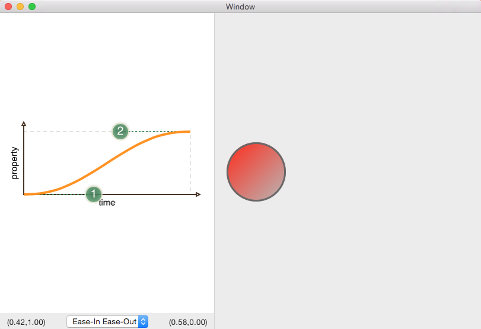

# Animation Timing

An OS X app for visualizing the timing curve in animations.

The timing is shown visually as its B&eacute;zier curve, and the curve can be edited by dragging the control points. The animation moves a ball between sides of the example pane using the specified animation timing and can be run by clicking the ball.

### Setup

This project uses git submodules, so after cloning, you will need to:

```
git submodule init
git submodule update
```

### Screenshot



### ToDo List

* Add the ability to have multiple animations that run together using different timings.
